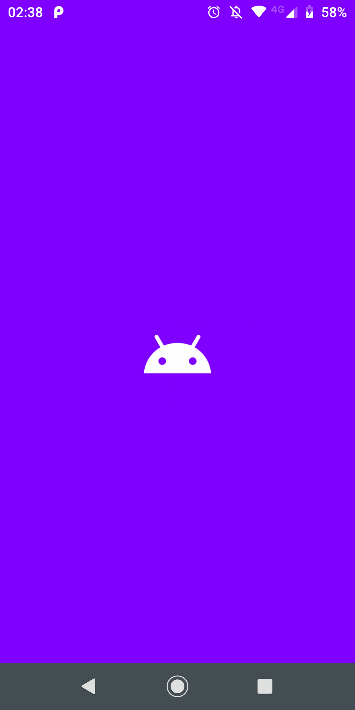
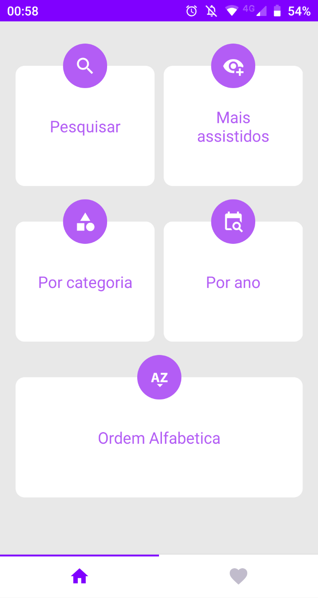
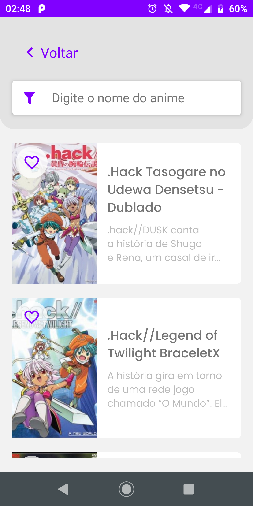
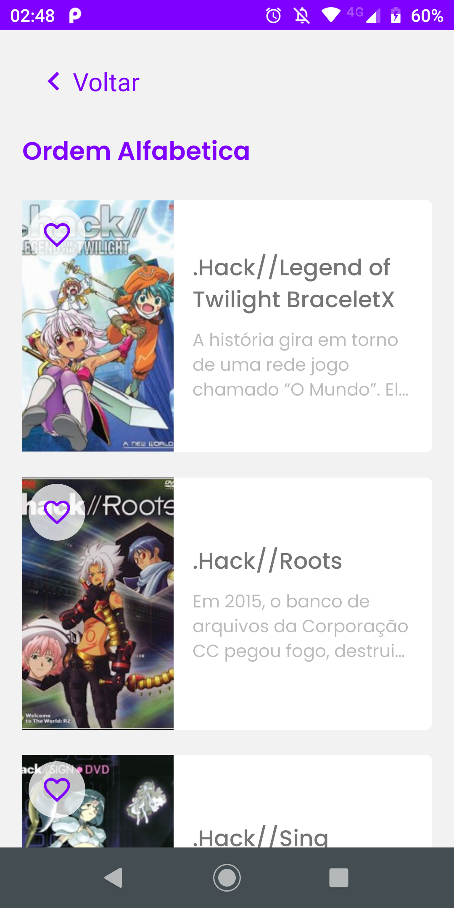
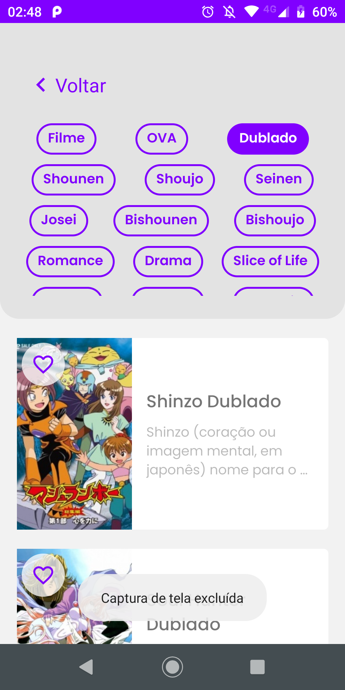

[![Contributors][contributors-shield]][contributors-url]
[![Forks][forks-shield]][forks-url]
[![Stargazers][stars-shield]][stars-url]
[![Issues][issues-shield]][issues-url]
[![LinkedIn][linkedin-shield]][linkedin-url]


<!-- PROJECT LOGO -->
<br />
<p align="center">
  <a href="https://github.com/PauloHCardosoN/anime-downloader">
    
  </a>

  <h1 align="center">Anime Downloader</h1>

  <p align="center">
    A React Native app to download animes episodes
    <br />
    <a href="https://github.com/PauloHCardosoN/anime-downloader"><strong>Explore the docs »</strong></a>
    <br />
    <a href="https://github.com/PauloHCardosoN/anime-downloader/issues">Report Bug</a>
    ·
    <a href="https://github.com/PauloHCardosoN/anime-downloader/issues">Request Feature</a>
  </p>
</p>


<!-- TABLE OF CONTENTS -->
## Table of Contents

* [About the Project](#about-the-project)
  * [Screenshtos](#screenshots)
  * [Built With](#built-with)
* [Getting Started](#getting-started)
  * [Installation](#installation)
* [Contributing](#contributing)
* [Contact](#contact)
* [If you want to support me](#If-you-want-to-support-me)


<!-- ABOUT THE PROJECT -->
## About The Project

### Screenshots

<div>
  
  
  
  
  
</div>


In the Anime Downloader, you can find animes by:
* Name
* Most watched
* Category
* Year
* Alphabetic Order

And when you find something that interests you, you can download the episodes.

### Built With
To build this application, I mainly used React Native which is a library created by Facebook to build native applications using Javascript.
* React
* React Native
* Redux


<!-- GETTING STARTED -->
## Getting Started

### Installation

1. Clone the repo

```sh
git clone https://github.com/PauloHCardosoN/anime-downloader.git
```
2. Install NPM packages
```sh
npm install
# or
yarn install
```

3. Run the project:
* On Android:
```sh
npm run android
# or
yarn android
```

* On IOS:
```sh
npm run ios
# or
yarn ios
```


<!-- CONTRIBUTING -->
## Contributing

Feel free to contribute to this project.

1. Fork the Project
2. Create your Feature Branch (`git checkout -b feature/AmazingFeature`)
3. Commit your Changes (`git commit -m 'Add some AmazingFeature'`)
4. Push to the Branch (`git push origin feature/AmazingFeature`)
5. Open a Pull Request


## Want to see more?

* Acess my portifolio: https://paulohcardoson.github.io
* Visit my repositories on github: https://github.com/PauloHCardosoN
* Call me on Telegram: @PauloHCardoso

## If you want to support me

* Fork, Star and Share this repo. That's it, goodbye ;)


<!-- MARKDOWN LINKS & IMAGES -->
<!-- https://www.markdownguide.org/basic-syntax/#reference-style-links -->
[contributors-shield]: https://img.shields.io/github/contributors/PauloHCardosoN/anime-downloader.svg?style=flat-square&color=8000FF
[contributors-url]: https://github.com/othneildrew/Best-README-Template/graphs/contributors

[forks-shield]: https://img.shields.io/github/forks/PauloHCardosoN/anime-downloader.svg?&color=8000FF
[forks-url]: https://github.com/PauloHCardosoN/anime-downloader/network/members

[stars-shield]: https://img.shields.io/github/stars/othneildrew/Best-README-Template.svg?style=flat-square&color=8000FF
[stars-url]: https://github.com/othneildrew/Best-README-Template/stargazers

[issues-shield]: https://img.shields.io/github/issues/othneildrew/Best-README-Template.svg?style=flat-square&color=8000FF
[issues-url]: https://github.com/othneildrew/Best-README-Template/issues

[linkedin-shield]: https://img.shields.io/badge/-LinkedIn-black.svg?style=flat-square&logo=linkedin&color=8000FF
[linkedin-url]: https://www.linkedin.com/in/paulohcardoson